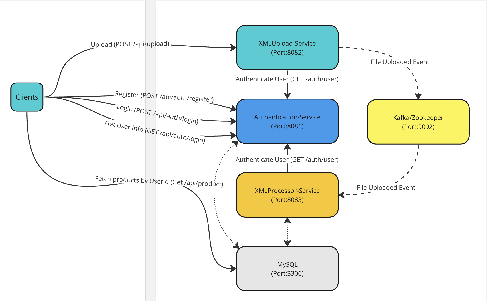
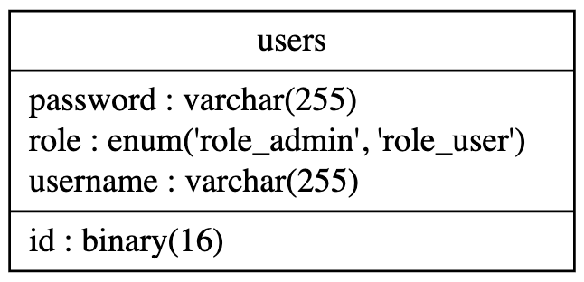
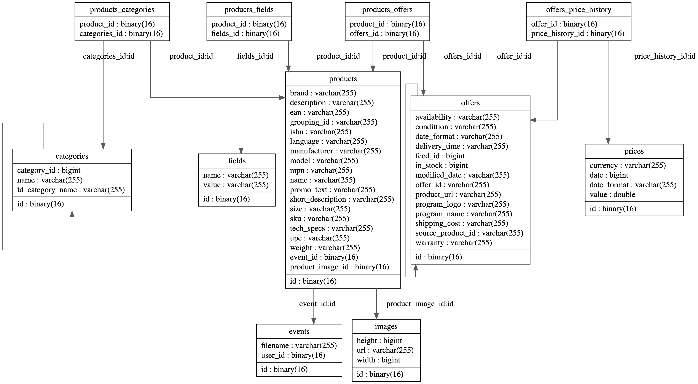

# ABC-Orchestrator

## Overview 

The ABC Company operates as an affiliate marketing firm, facilitating connections between product advertisers and publishers. Advertisers are required to upload their products and provide relevant offer details to the platform, which can be accessed by publishers through REST APIs.
ABC Cloud is a set of Java microservices which meet the requirements. The microservices are including: 
1. [ABC-Authentication-Service](https://github.com/fargholamian/ABC-Authentication-Service)
   This service is an authentication service. It provides a set of REST APIs for user registration, login, and user information retrieval. The service uses MySQL as the underlying database to store user information such as username, password, and user roles. Please [README](https://github.com/fargholamian/ABC-Authentication-Service/blob/main/README.md) 
####
2. [ABC-XMLUploader-Service](https://github.com/fargholamian/ABC-XMLUploader-Service)
   This service is responsible for receiving, validating, and storing XML files. It provides a REST API endpoint where users can upload XML files. Upon receiving a file, the service performs XML validation against XSD files, stores the validated file on the file system, and sends an event via Kafka to notify the [ABC-XMLProcessor-Service](https://github.com/fargholamian/ABC-XMLProcessor-Service) for further processing. Please [README](https://github.com/fargholamian/ABC-XMLUploader-Service/blob/main/README.md)
####
3. [ABC-XMLProcessor-Service](https://github.com/fargholamian/ABC-XMLProcessor-Service)
   This service is designed to process XML files, store the data in a MySQL database, and provide REST APIs for fetching the data. It listens to a Kafka topic to receive events sent by the [ABC-XMLUploader-Service](https://github.com/fargholamian/ABC-XMLUploader-Service). After receiving an event, it retrieves the corresponding file from the file system, processes it, and stores the product objects into the database. Please [README](https://github.com/fargholamian/ABC-XMLProcessor-Service/blob/main/README.md)

##

This Orchestrator will help to set up all the services on local environment using `Docker Compose`. 


## Topology



## Databse Schema 
[ABC-Authentication-Service](https://github.com/fargholamian/ABC-Authentication-Service) uses `auth` schema which is automatically created by Spring Data Jpa. It has only one table for storing user information.



[ABC-XMLProcessor-Service](https://github.com/fargholamian/ABC-XMLProcessor-Service) uses `product` schema which is automatically created by Spring Data Jpa. 


## API Endpoints
[ABC-Authentication-Service](https://github.com/fargholamian/ABC-Authentication-Service) offers the following REST APIs:

- **Register User** - `POST /api/auth/register`: This API allows users to create a new account by providing necessary registration details. The request body should follow the `RegistrationRequest` format.

    ```
    curl --location --request POST 'http://127.0.0.1:8081/api/auth/register' \
    --header 'Content-Type: application/json' \
    --data-raw '{
        "username" : "admin",
        "password" : "admin",
        "confirm_password": "admin"
    }'
    ```
- **User Login** - `POST /api/auth/login`: Users can authenticate themselves and obtain a JWT (JSON Web Token) access token by using this API. The request body should adhere to the `AuthenticationRequest` format. The response includes the generated access token and a refresh token.
    ```
    curl --location --request POST 'http://localhost:8081/api/auth/login' \
    --header 'Content-Type: application/json' \
    --data-raw '{
    "username" : "admin",
    "password" : "admin"
    }'
    ```
- **Get User Information** - `GET /api/user`: Other services can utilize this API to verify a JWT access token and retrieve user information. The endpoint requires a valid JWT token in the request header. Upon successful verification, it returns the requested user information.
    ```
    curl --location --request GET 'http://localhost:8081/api/user/' \
    --header 'Authorization: Bearer AUTH_TOKEN \
    ```

[ABC-XMLUploader-Service](https://github.com/fargholamian/ABC-XMLUploader-Service) offers the following REST APIs:
- **XML File Upload** - `POST /api/upload`: This API allows users to upload XML files.
    ```
    curl --location --request POST 'http://localhost:8082/api/upload' \
    --header 'Authorization: Bearer AUTH_TOKEN' \
    --header 'Cookie: JSESSIONID=1FCC74B73931C1729E3DFD47664314C3' \
    --form 'file=@"file.xml"'
    ```
[ABC-XMLProcessor-Service](https://github.com/fargholamian/ABC-XMLProcessor-Service) offers the following REST APIs:
- **Retrieve Products by UserId** - `GET /api/product`: Retrieves a list of products for a given userId.
    - Parameters:
        - `userId` (mandatory): The ID of the user to fetch products for.
        - `offset` (optional): The page offset (default: 0).
        - `size` (optional): The page size (default: 100, maximum: 1000).
        - `format` (optional): The output format (default: JSON). Supported values: JSON, XML, CSV.
    - Response: Returns a list of products in the requested format.
    ```
    curl --location --request GET 'http://127.0.0.1:8083/api/product?userId={user_id}&offset={offset}&size={sizr}&format={format}' \
    --header 'Authorization: Bearer AUTH_TOKEN'
    ```

The [Postman collection](https://github.com/fargholamian/abc-orchestrator/blob/main/ABC-Cloud-API-Collection.postman_collection.json) can also be used for consuming the API endpoints.


## Prerequisites

To run this project, ensure that you have the following software installed:

- Docker 
- Docker Compose

## Getting Started

Follow the steps below to set up and run the project:

1. Clone this repository to your local machine.
2. Open a terminal and navigate to the project's root directory.
3. run `chmod +x build_and_run.sh`
4. run `./build_and_run.sh`

    This will clone other repositories (authentication-service, xml-upload-service and xml-processor-service) in the current directory. Then build a Docker image for each of them and finally run `docker compose up -d`

    ### after doing all the steps:
    - Authentication-Service will now be running and listening on port 8081. 
    - XmlUploader-Service will now be running and listening on port 8082.
    - XmlProcessor-Service will now be running and listening on port 8083.
    - MySQL will now be running and listening on port 3306.
    - Kafka will now be runnig and listening on port 29092 (9092 is exposed inside the docker network).

## How it works
Follow the steps below:
1. using **Register User API** (POST /api/auth/register) create an account
2. using **User Login** (POST /api/auth/login) get a valid token. Copy the `auth_token` from response and put it as a AUTH_TOKEN for next API calls.
3. using **XML File Upload** (POST /api/upload) upload a valid XML file. 
4. using **Get User Information** (GET /api/user) get your used_id for using it in the next step.
5. using your user_id and **Retrieve Products by UserId** (GET /api/product), fetch the products in various formats from the database.